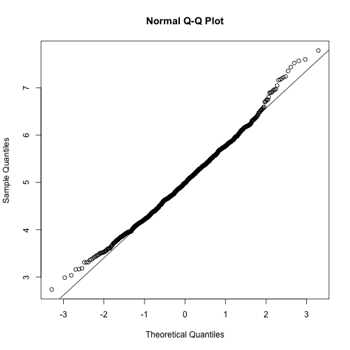

  
# Part 1: Simulation Exercise
  
## Simulation purpose

The exponential distribution can be simulated in R with `rexp(n, lambda)` where `lambda`($\lambda$) is the rate parameter. The mean of exponential distribution is $1/\lambda$ and the standard deviation is also $1/\lambda$. For this simulation, we set $\lambda=0.2$. In this simulation, we investigate the distribution of averages of 40 exponential(0.2)s. 

## Simulation codes


```r
# Set seed
set.seed(123)
lambda <- 0.2

# Set sample size = 40, simulation times = 1000
sample.size <- 40
simulations <- 1000

# Calculate the simulated averages of 40 exponentials
sim.result <- matrix(rexp(simulations * sample.size, rate=lambda), 
                     simulations, sample.size)
sim.average <- rowMeans(sim.result)
```

## Results

**1. Show where the distribution is centered at and compare it to the theoretical center of the distribution.**    
  

```r
# center of the distribution
mean(sim.average)
```

```
## [1] 5.012
```

```r
# theoretical center of the distribution
1/lambda
```

```
## [1] 5
```

Answer: The distribution is centered close to the theoretical center of the distribution.


**2. Show how variable it is and compare it to the theoretical variance of the distribution.**  


```r
# variance of the distribution
var(sim.average)
```

```
## [1] 0.6088
```

```r
# theoretical variance of the distribution
1 / ((lambda^2) * sample.size)
```

```
## [1] 0.625
```

Answer: the variability in the distribution is close to the theoretical variance of the distribution.

**3. Show that the distribution is approximately normal.**   
  

```r
# use qqplot and qqline to show the distribution is approximately normal
qqnorm(sim.average)
qqline(sim.average)
```

 

Answer: The Q-Q plot proves the statement.  

**4. Evaluate the coverage of the confidence interval for $1/\lambda : \bar{X} \pm 1.96 \frac{S}{\sqrt{n}}$.**  

Answer:


```r
# Confidence interval
mean(sim.average) + c(-1, 1) * 1.96 * sd(sim.average)
```

```
## [1] 3.483 6.541
```

Below is a more detailed graph showing the coverage of the confidence interval.


```r
# Coverage of confidence interval
lambdas <- seq(1, 10, by=0.01)
coverage <- sapply(lambdas, function(l) {
  mu.hat <- rowMeans(matrix(rexp(sample.size*simulations, rate=0.2), simulations, sample.size))
  conf.inv <- qnorm(0.975) * sqrt(1/lambda**2/sample.size)
  lower <- mu.hat - conf.inv
  upper <- mu.hat + conf.inv
  mean(lower < l & upper > l)
})

# Plot coverage
library(ggplot2)
qplot(lambdas, coverage) + geom_hline(yintercept=0.95, col="blue")
```

 
